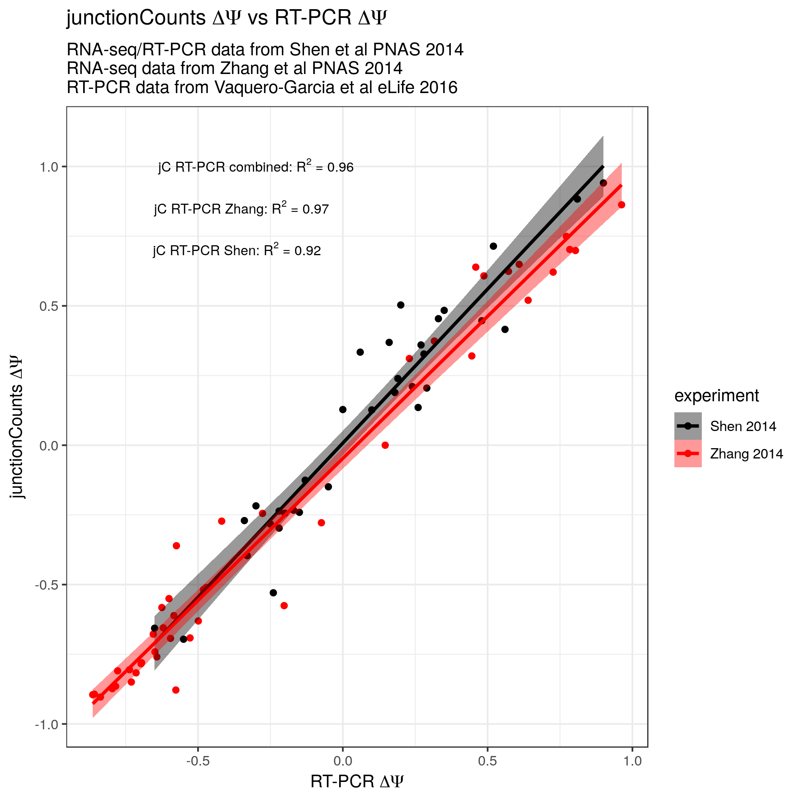

# junctionCounts

junctinCounts is a tool intended to identify and quantify binary alternative splicing events from RNA-seq data. junctionCounts currently consists of two primary utilities: `infer_pairwise_events.py`, which identifies binary alternative splicing events (e.g. skipped exon events), and `junctionCounts.py`, which quantifies those events (i.e. provides a percent-spliced-in, or PSI value) from Illumina RNA-seq data (specifically from a BAM file). These utilities can be used independent of one another, and events identified independently by `infer_pairwise_events.py` and the transcripts with which they are associated (as marked in the .ioe files - a format introduced by the authors of SUPPA) may be useful to a variety of researchers, regardless of their interest in performing short read quantification. While `junctionCounts.py` could in principle be run without the use of `infer_pairwise_events.py`, it may be easiest to use both tools together for quantification due to the specific reqirements of the input GTF for the quantification.

# Dependencies

`python2.7`  
`ncls` (https://github.com/hunt-genes/ncls)  
`numpy`  
`pysam`  

Note that `ncls`, `numpy`, and `pysam` are all python packages that can be installed using `pip install package_name`.

# infer_pairwise_events.py

## Description

`infer_pairwise_events.py` takes as input a transcriptome GTF file and performs a pairwise comparison of all overlapping transcripts to identify the set of (one or more) minimal binary alternative splicing (or other forms of co/post-transcriptional processing) events that differentiate each pair. `infer_pairwise_events.py` considers an alternative event to be a collection of non-shared (i.e. unique to one transcript in the considered pair) exon boundaries that is bounded either a) by a set of shared outer exon boundaries, or b) by transcript termini. This definition includes all canonical binary alternative splicing events (of which the author is aware such as skipped exons, alternative donors/acceptors, alternative first/last exons) while also including non-canonical alternative splicing events. A schematic illustrating the events in question is below. Note that certain event "types" (specifically CO, CF, and CL) are generic terms that stand for 'complex', 'complex first', and 'complex last' respectively. These terms do not relate to modern concepts of alternative splicing complexity (i.e. non-binary events) but rather are buckets for events that both a) do not fit into the other, more specific categories, and b) do not involve the transcript termini (CO), involve different 5'-termini (CF), or involve different 3'-termini (CL). This also applies to event types MF, ML, MS, MR (multiple first, last, multiple skipped exon, and multiple retained intron respectively) - these events are highly analogous to AF, AL and SE events, but are not restricted to one pair of alternative exons in the case of AF, AL (for example, an MF or ML event could have 3 exons unique to the included form and two unique to the excluded form) or a single alternative exon in the case of SE. UF and UL events are another pair of unconventional events. They are situations in which the included form transcript's penterminal exon is the excluded form transcript's terminal exon, and the included form contains one additional (up or downstream respectively) exon. These can be found in established annotations but seem unusual and are possibly artifactual.

The meaning of each abbreviation (bearing in mind the above discussion) is as follows:   
SE - skipped exon   
MS - multiple skipped exon   
MX - mutually exclusive exons   
A5 - alternative 5'-splice site   
A3 - alternative 3'-splice site   
RI - retained intron   
MR - multiple retained intron   
AF - alternative first exon   
AL - alternative last exon   
MF - multiple first exon   
ML - multiple last exon   
CF - complex first   
CL - complex last   
AT - alternative transcription start site (tandem UTR)   
AL - alternative polyadenylation (tandem UTR)   
UF - unique first   
UL - unique last   

## Basic usage

### Input file descriptions

### Output file descriptions

## Help statement

usage: infer_pairwise_events.py [-h] [--transcript_gtf TRANSCRIPT_GTF]  
                                --outdir OUTDIR  
                                [--min_exon_length MIN_EXON_LENGTH]  
                                [--min_intron_length MIN_INTRON_LENGTH]  
                                [--max_exon_length MAX_EXON_LENGTH]  
                                [--max_intron_length MAX_INTRON_LENGTH]  
                                [--dump_pkl_file]  
                                [--bedtools_path BEDTOOLS_PATH]  
                                [--suppress_output]  

optional arguments:  
  -h, --help            show this help message and exit  
  --transcript_gtf TRANSCRIPT_GTF
                        Full transcript gtf file. Not required, but if not
                        provided a transcript dict must be passed as a
                        parameter to the main function.  
  --outdir OUTDIR       Path to output directory  
  --min_exon_length MIN_EXON_LENGTH
                        Minimum allowable exon length in input gtf.
                        Transcripts with shorter exons will be filtered.
                        (default: 3)  
  --min_intron_length MIN_INTRON_LENGTH
                        Minimum allowable intron length in input gtf.
                        Transcripts with shorter introns will be filtered.
                        (default: 20)  
  --max_exon_length MAX_EXON_LENGTH
                        Maximum allowable exon length in input gtf.
                        Transcripts with longer exons will be filtered
                        (default = 35000)  
  --max_intron_length MAX_INTRON_LENGTH
                        Maximum allowable intron length in input gtf.
                        Transcripts with longer introns will be fitlered
                        (default = 1000000)  
  --dump_pkl_file       If set, program will dump pickle file of event dict.  
  --bedtools_path BEDTOOLS_PATH
                        Path to bedtools executable (default = 'bedtools')  
  --suppress_output     If set, GTF, GFF3, and IOE files will not be written.  

# junctionCounts.py

## Basic usage

### Output file descriptions

### Input file descriptions

## Benchmarking

### rt-PCR

## Help statement
